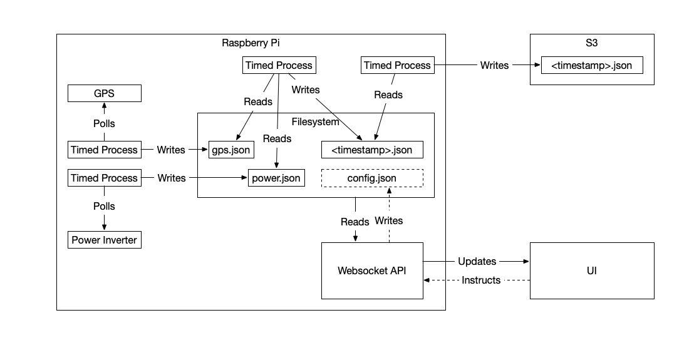

# Trailer Monitor - Raspberry Pi



The core of my trailer monitoring system is a Raspberry Pi running a set of python and bash scripts. These scripts are scheduled with systemd.

Breaking the problem up into a set of independent scripts provides several benefits:

* Parts of the system can be turned on and off independently
* Different schedules can be set for each script (e.g. gps.py polls for changes every second, power.py polls for changes every 10 seconds, snapshot.py aggregates data every minute)
* Temporary failures of some parts of the system don't inhibit other parts of the system (e.g. snapshots will be captured even if S3 is unreachable)
* Addition of new components is straightforward

## Location Monitoring

[gps.py](./src/gps.py) periodically queries gpsd, which reads data from a USB GPS receiver. It then formats this data and writes it out as `data/gps.json`.

[trailer-gps.service](systemd/trailer-gps.service) is the systemd service which ensures gps.py is always running.

## Power Monitoring

[power.py](./src/power.py) periodically queries the modbus interface on my Growatt "all in one" charger/inverter. It then formats this data and writes it out as `data/power.json`.

The company that sold me the Growatt inverter was kind enough to request [the modbus protocol spec](./doc/growatt-modbus-protocol.pdf) from the manufacturer.

[trailer-power.service](./systemd/trailer-power.service) is the systemd service which ensures power.py is always running.

Unfortunately, Growatt uses a common generic vendor and product id, which gpsd attempts to register as a GPS device. When this happens, pymodbus errors when attempting to read data from the inverter. To fix this, the following line must be commented out in `/lib/udev/rules.d/60-gpsd.rules`:

```
# rule disabled by atru5 as it matches my power inverter
#ATTRS{idVendor}=="10c4", ATTRS{idProduct}=="ea60", SYMLINK+="gps%n", TAG+="systemd", ENV{SYSTEMD_WANTS}="gpsdctl@%k.service"
```

## Snapshots

[snapshot.py](./src/snapshot.py) periodically reads `data/gps.json` and `data/power.json`, merges them together, and writes them out as `data/{timestamp}.json`. These timestamped files allow me to do data analytics over time.

[trailer-snapshot.service](systemd/trailer-snapshot.service) is the systemd service which ensures snapshot.py is always running.

## Sync

[sync.sh](./src/sync.sh) periodically syncs `data/` to an S3 bucket. This ensures that I don't lose data, and provides me a way to retrieve last known state should my trailer disappear and go offline.

[trailer-snapshot.service](./systemd/trailer-sync.service) is the systemd service which ensures sync.sh is always running.

## Websockets

[websocket.py](./src/websocket.py) exposes a websockets interface for clients. The script detects timestamp changes to `data/gps.json` or `data/power.json` and feeds the updated data to any connected clients.

[trailer-websocket.service](./systemd/trailer-websocket.service) is the systemd service which ensures websocket.py is always running.

Currently the only websockets client is [the iOS app](https://github.com/joshgubler/trailer-monitor-ios).
